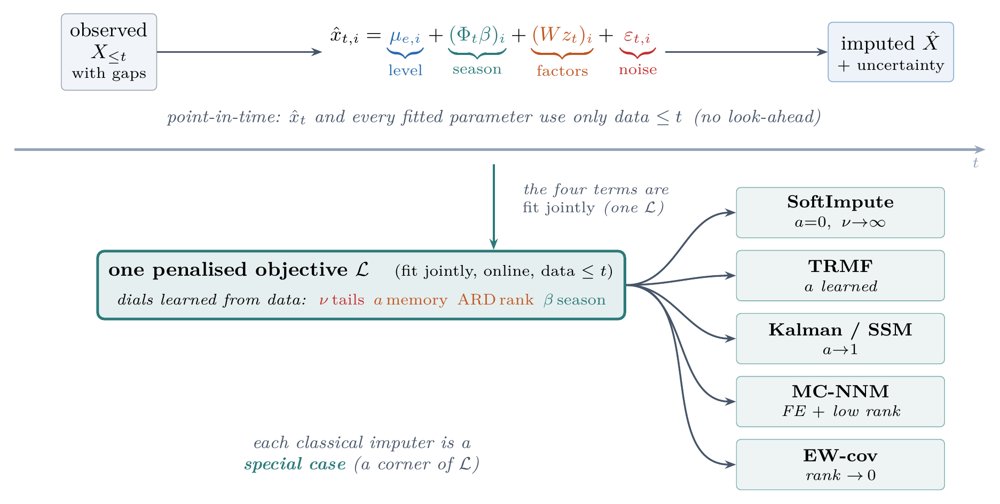
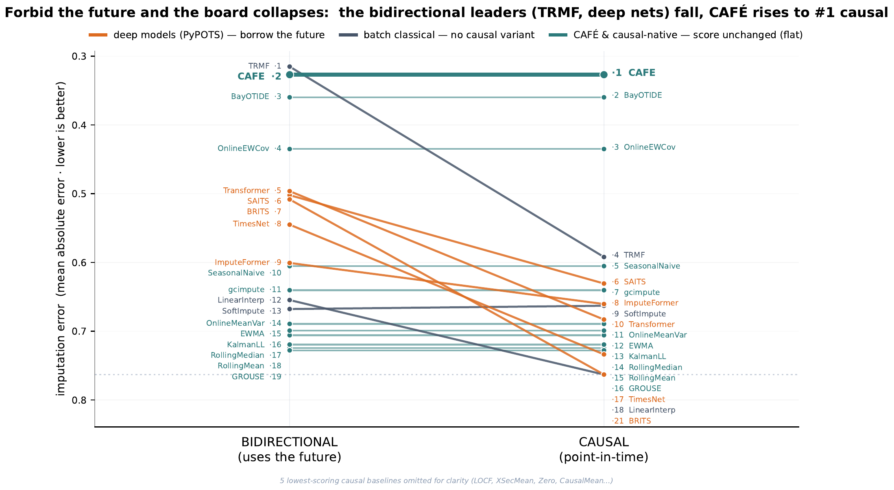
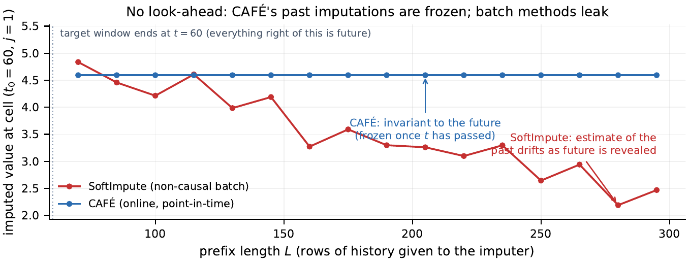
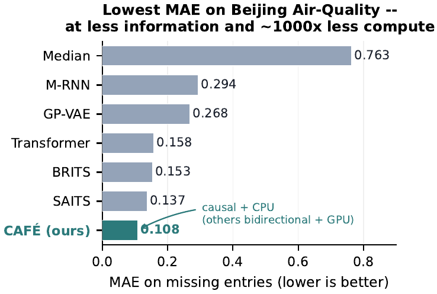
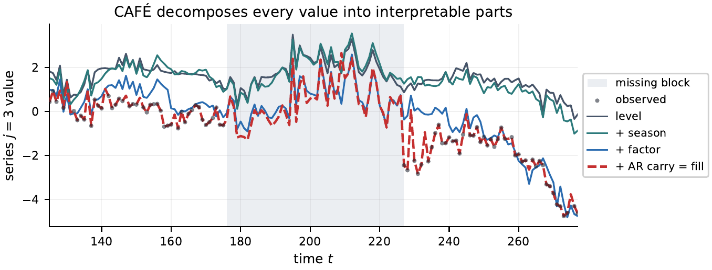
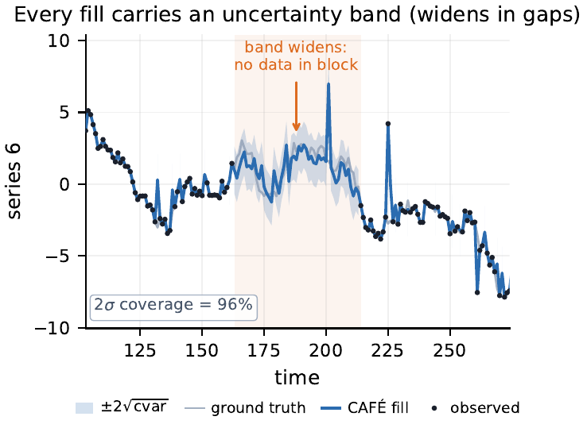
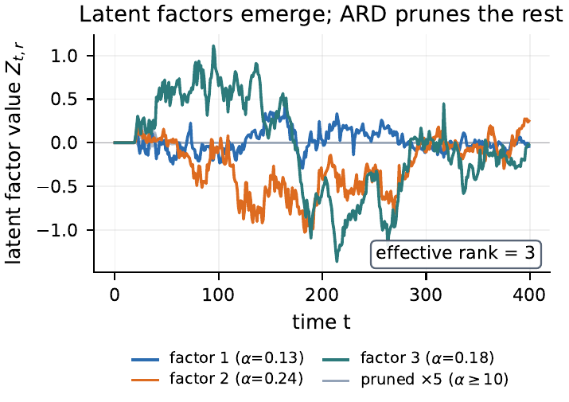
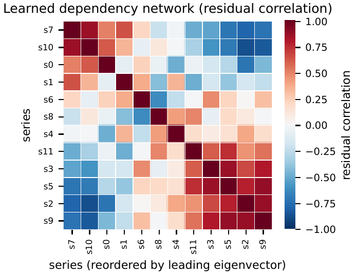
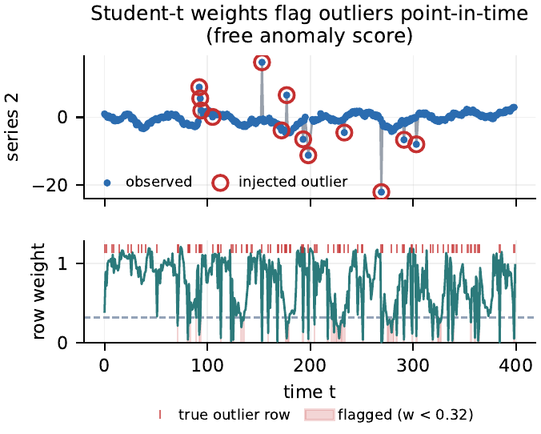
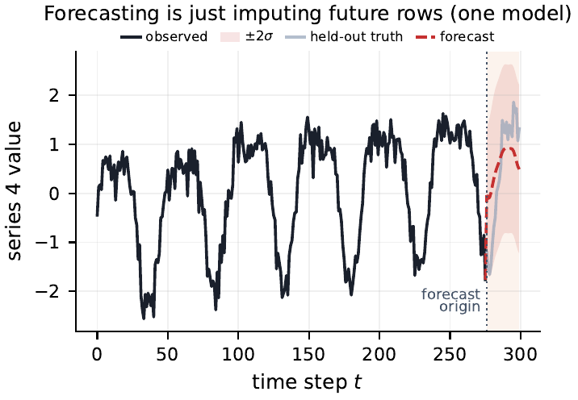

<h1 align="center">CAFÉ</h1>
<p align="center"><b>Causal Adaptive Factor Estimation</b><br>
Zero-config, CPU-first, <b>point-in-time</b> missing-value imputation —
with uncertainty, factors, anomalies and forecasts from a single forward pass.</p>

<p align="center">
<a href="https://pypi.org/project/cafe-impute/"></a>


</p>

<p align="center">
Derek Snow &nbsp;·&nbsp; Matthew Lyberg &nbsp;·&nbsp; Eeshaan Asodekar<br>
<sub><a href="https://github.com/sovai-research">Sovai Research</a></sub>
</p>

> **CAFÉ** is the model formerly developed in this repo under the name **TIMARA**.
> It is a *mechanistic statistical model — not a neural network*: one penalised
> objective whose learned parameters make SoftImpute, TRMF, the Kalman filter,
> MC-NNM and Gaussian conditional-mean imputation all **special cases**.

<p align="center">
<picture>
  <source media="(prefers-color-scheme: dark)" srcset="docs/figures/hero-dark.png">
  
</picture>
<br>
<sub><b>CAFÉ in one picture.</b> Every value is the sum of four interpretable parts — a per-series
level, a Fourier season, a few shared low-rank factors and heavy-tailed noise — filled using
<b>only data up to its own time</b> <i>t</i> (a mechanical verifier certifies no look-ahead). One
penalised objective whose dials are learned from the data; the classical imputers are its corners,
so there is no model to select.</sub>
</p>

---

## Why CAFÉ

Almost every imputer fills `X[t]` using the **entire** series — including the future.
That silently leaks look-ahead into any sequential pipeline (a trading backtest, an
online controller, an early-warning monitor) and inflates measured performance.

CAFÉ fills `X[t]` using **only data up to time `t`** (past + the contemporaneous
cross-section), and a mechanical verifier *proves* no past imputation changes when
the future arrives. It is:

- **Causal / point-in-time** — backtest-safe by construction (the moat).
- **Zero-config** — `cafe.impute(data)`; rank, memory, tail-robustness and seasonality
  are learned from the data (ARD / empirical-Bayes / EM), not set by you.
- **CPU-first, `numpy`-only** — the entire estimator runs on `numpy` alone (no `scipy`,
  no compiled extension), no GPU, no training run. Installs in seconds. Runs the full
  benchmark suite in ~1 s.
- **Container-native** — `numpy`, `pandas`, `polars`, 1D or 2D, dtype/labels preserved.
- **More than imputation** — the same pass yields per-cell uncertainty, latent
  factors, anomaly scores, an additive decomposition, a dependency network and forecasts.

### The "two-of-three" claim

Prior strong imputers pick at most two of {**causal / point-in-time**, **CPU-only**,
**competitive with bidirectional deep SOTA**}. The published front-runners — SAITS,
BRITS, Transformer, CSDI, ImputeFormer, FGTI — are all **bidirectional** (they fill
the past using the future) **and GPU-trained**. CAFÉ is, to our knowledge, the first
method to credibly claim **all three at once**: strictly point-in-time, `numpy`-only on
a CPU, and in the same accuracy band as those bidirectional deep models.

On `data/beijing_clean.npy` (the longest fully-observed slice, 17,117 × 132,
per-column z-scored once), under a **10% point-MCAR mask** (`np.random.default_rng`,
seeds {0,1,2}, MAE on the standardised scale over held-out cells), CAFÉ imputes the
**full series causally/online** and reaches **MAE ≈ 0.108**. The published deep numbers
(SAITS, BRITS, …) come from a **different, windowed train/val/test protocol** on a
different Beijing preprocessing, so they are **context, not a head-to-head leaderboard**
— CAFÉ is *not* ranked among them. Under the TSI-Bench source, diffusion-based **CSDI
reaches 0.102**, lower than CAFÉ; we therefore make **no protocol-independent "lowest
MAE" claim**. The point is the moat: a causal, CPU-only method landing *in that band*
at all. Published numbers come from one reconciled registry
([`bench/refs_published.py`](bench/refs_published.py)); see [`paper/cafe.pdf`](paper/cafe.pdf).

## Install

```bash
pip install cafe-impute            # core (numpy only)
pip install "cafe-impute[all]"     # + pandas, polars, matplotlib
```

<details open><summary>…or from source</summary>

```bash
git clone https://github.com/sovai-research/cafe.git
cd cafe
pip install -e ".[all]"
```
</details>

## Quick start

```python
import cafe

# zero-config — same container type comes back, gaps filled, no look-ahead
filled = cafe.impute(df)            # pandas / polars DataFrame, or numpy array, 1D or 2D
```

A DataFrame may freely mix types: a `date` column, string ids and numeric sensors all
in one frame. CAFÉ imputes **only the numeric columns**, passes everything else through
untouched, and preserves column order — so `cafe.impute(raw_df)` just works, no manual
column selection.

> **Notebooks** (all runnable, executed end-to-end):
> - [`cafe_tutorial.ipynb`](notebooks/cafe_tutorial.ipynb) — polars-first deep dive on real
>   ETTh1: the one-liner, the no-look-ahead proof, accuracy, calibrated + gap-widening
>   uncertainty, factors, anomaly detection, exact decomposition, dependency net, forecast.
> - [`cafe_it_just_works.ipynb`](notebooks/cafe_it_just_works.ipynb) — every container/shape
>   (numpy/pandas/polars, 1D/2D/3D), five real datasets, the numpy-only proof, and the nasty
>   edge cases — all via one call.
> - [`cafe_benchmark.ipynb`](notebooks/cafe_benchmark.ipynb) — `cafe.benchmark()` vs causal
>   and bidirectional baselines, with cited published SOTA.

### Benchmark in one line

```python
cafe.benchmark()                 # synthetic data, CAFÉ vs baselines, printed table
cafe.benchmark(df)               # your data, scored honestly (causal vs bidirectional)
cafe.benchmark("beijing")        # real data + cited published SOTA reference rows
```

On the **Beijing Multi-Site Air-Quality** benchmark (17,117 × 132, **10% point-MCAR**,
standardised), CAFÉ — *causal, CPU-only, no training* — reaches **MAE ≈ 0.108**, in the
band of the published **bidirectional** deep models (SAITS, BRITS, Transformer) while
being the only causal one. Those deep numbers use a **different windowed train/val/test
protocol**, so the benchmark prints them as a clearly-labelled, cited **reference block —
context, not a ranked board** — and CAFÉ is not placed among them; under one source CSDI
(0.102) is lower, so no "lowest MAE" claim is made. Every deep competitor uses the
*future* to fill the past (smoothing — forbidden look-ahead in a backtest); CAFÉ does
not. The benchmark runs the simple baselines *live* on the same mask, separates **causal
vs bidirectional** tiers, and mirrors published numbers from the single registry
[`bench/refs_published.py`](bench/refs_published.py) — see
[`notebooks/cafe_benchmark.ipynb`](notebooks/cafe_benchmark.ipynb).

### Everything from one causal pass

```python
res = cafe.CAFE().run(df)

res.imputed                  # the filled data (original container)
res.uncertainty              # per-cell posterior std  (bands widen inside long gaps)
res.confidence_interval()    # (lower, upper) at 1.96 sigma
res.factors()                # latent common factors z_t  (streaming robust DFM)
res.anomaly_scores()         # per-time outlier score in [0,1] (0 = fit, 1 = outlier)
res.decompose()              # {'level','season','factor','residual'} — sums to the data
res.dependency_network()     # NxN residual-correlation network between series
res.params                   # learned dials: {'nu', 'ar', 'effective_rank'}

# forecasting == imputing future rows (AR/Kalman state), with the same model
future = cafe.CAFE().forecast(df, horizon=24)
```

### Missingness as signal (causal features)

When *where* a value is missing is itself informative (clinical panels, sensors,
financial reporting), the gap pattern is a feature — not just a hole to fill. CAFÉ
ships a **strictly forward-only** feature builder: every feature at row `t` is a
function of rows `≤ t` only (no future), so it is safe to use alongside the imputed
values in a downstream causal model.

```python
from cafe.missingness import missingness_features

# pass the original (with NaNs) OR pass mask= explicitly when the data is already filled
feats = missingness_features(df, mask=was_missing)        # same container type back
```

It emits five families per numeric column: `was_imputed` (indicator),
`time_since_obs` (BRITS-style steps since last observed), `gap_length` (current run of
missing), `missing_rate` (causal expanding fraction missing), and `selective_mim` —
indicators emitted **only for columns whose missingness is informative**, scored
leak-free by an expanding contemporaneous association test to avoid high-dimensional
MIM overfitting. Returns the same container type (`<col>__<feature>` columns), or pass
`return_meta=True` for the raw arrays plus the list of informative columns.

## More in the research harness (`bench/`)

The library is deliberately small; the empirical evidence lives in `bench/`, each
experiment self-contained, CPU-only, and run *live* (no fabricated numbers):

- **`refs_published.py`** — the single reconciled registry of *published* competitor
  numbers (one source of truth; both values kept where sources disagree).
- **`exp_seeds.py`** — multi-seed paired CAFÉ-vs-causal-baseline comparison with
  Student-t / bootstrap CIs and a paired significance test.
- **`exp_maskgrid.py`** — MAE/RMSE across mask pattern × rate (point / subsequence /
  block × 0.1/0.3/0.5), causal vs non-causal reference columns.
- **`exp_backtest_lookahead.py`** — quantifies the *decision* cost of look-ahead from
  non-causal imputation in a walk-forward backtest (CAFÉ's gap is exactly 0).
- **`exp_downstream.py`** — downstream forecasting utility under a strict temporal
  split (reconstruction MAE is neither necessary nor sufficient for downstream gain).
- **`exp_calibration_crps.py`** + **`metrics_prob.py`** — CRPS, coverage and sharpness
  for the predictive intervals (mask-aware probabilistic metrics, NLL dropped).
- **`exp_mnar_scope.py`** — MCAR→MNAR degradation and an honest scope statement of what
  self-censored values CAFÉ can and cannot recover.
- **`m_naive.py` / `online_baselines.py`** — naive and causal/online rivals (LOCF,
  seasonal-naive, GROUSE-lite, streaming EW-cov), each tagged causal / non-causal.

`bench/repro.py` lists every generator and the paper table/figure it writes;
`make repro` shows the manifest and `make repro-run` regenerates them.

## What it is (in one paragraph)

CAFÉ reads each value as **level + season + shared trend + noise**: a per-series
running level, a few Fourier waves, a handful of common factors that move many series
together, and heavy-tailed residual noise. To fill a hole it adds up the pieces it can
compute from the past and the rest of the current row — the reasoning a careful analyst
would apply, done automatically, online, and provably without peeking at the future.
The four "dials" (how many factors, how much memory, how heavy the tails, how strong
the seasonality) are learned from the data. No neural network, no training phase.

**The objective** — one penalised loss, fit online:

$$
\min_{\mu,\beta,W,z}\ \sum_{t,i}\rho_\nu\!\big(x_{ti}-\mu_{e,i}-(\Phi_t\beta)_i-(z_tW^\top)_i\big)
\;+\;\underbrace{\sum_l \alpha_l\lVert W_{:,l}\rVert^2}_{\text{ARD}\,\to\,\text{rank}}
\;+\;\underbrace{\lambda_z\sum_t\lVert z_t-a\,z_{t-1}\rVert^2}_{\to\ \text{dynamics}}
\;+\;\underbrace{\lambda_\beta\lVert\beta\rVert^2}_{\to\ \text{season}}
\;+\;\underbrace{\mathrm{ridge}(\mu)}_{\to\ \text{FE}}
$$

with latent dynamics $z_t = a\,z_{t-1} + \eta_t$ and heavy-tailed residuals $\varepsilon \sim t_\nu(0,\Psi)$.
Turn the learned dials and the classical imputers fall out **exactly** — they are corners of this one space:

| Special case | Recovered when |
| --- | --- |
| **SoftImpute** | $a=0,\ \nu\to\infty$ — no dynamics, Gaussian |
| **TRMF** | $a$ learned — AR factor dynamics |
| **Kalman / SSM** | $a\to1$ — random-walk state |
| **MC-NNM** | fixed effects $+$ low rank |
| **EW-cov** | rank $\to 0$ — pure cross-sectional covariance |

## Repository layout

```
src/cafe/          the library (_core.py = the estimator, io.py = container adapters,
                   model.py = CAFE / CafeResult / impute)
src/tests/         smoke tests (container round-trip + causality verifier)
paper/             the CAFÉ paper (cafe.tex, cafe.pdf) + figures/
bench/             research harness: 22-case arena, causal verifier, robustness
                   contract, baselines, and the model under study (c_unified_penmf.py)
data/              published benchmark datasets
```

`bench/` is the research lab (benchmarks, the causal/robustness verifiers, the ablation
history); `src/cafe/` is the packaged product. Both share the same estimator.

## Guarantees

- **No look-ahead** — `src/tests/test_smoke.py::test_causality_no_lookahead` asserts past
  imputations are unchanged when the future is appended; `bench/causal.py` runs the full
  time-prefix verifier across the benchmark suite.
- **Robustness** — `bench/robustness.py` checks finite, same-shape output on every edge
  input (all-NaN, 1×1, constant, Inf, huge/tiny, wide/tall, single entity/time).

## The evidence

The whole case for CAFÉ is one experiment: **forbid the future, and the leaderboard collapses.**

<p align="center">
<br>
<sub><b>Forbid the future and the board collapses.</b> Each line is a method; the <i>y</i>-axis is MAE on a
shared scale. <b>Left</b> = the standard <b>bidirectional</b> game (a method may read the future);
<b>right</b> = strict <b>causal</b>, point-in-time scoring. Every causal-native method is a flat line — its
score is unchanged (∆ = 0). The bidirectional front-runners — TRMF, the deep imputers, linear interpolation —
slope up and drop, because the advantage they posted <i>was</i> look-ahead. CAFÉ rises to <b>#1 causal</b>.</sub>
</p>

<p align="center">
<br>
<sub><b>The moat: no look-ahead.</b> For a fixed early missing cell, we re-impute on growing time-prefixes.
CAFÉ's estimate is <b>frozen the moment its time passes</b> (flat line), so a backtest cannot be contaminated;
the non-causal batch method's “past” estimate keeps drifting as the future is revealed.</sub>
</p>

<p align="center">
<br>
<sub><b>Accuracy — in the band of GPU deep nets, causal and on a CPU.</b> Beijing Air-Quality
(10% point-MCAR, standardised, 3 seeds): CAFÉ reaches MAE ≈ 0.108. The deep numbers use a different
windowed train/val/test protocol, so they are cited <i>context, not a ranked board</i> (see “Why CAFÉ” above).</sub>
</p>

<details open>
<summary><b>📊 The deployable (causal) leaderboard</b> — ranked by the score that survives deployment, not the look-ahead-inflated one</summary>

Mean MAE over 8 structured datasets. Methods are ranked by **causal** (strict point-in-time) MAE — the number
that survives a backtest — not by the future-using **bidirectional** MAE that flatters look-ahead. `∆ = causal − bidir`
is the accuracy a method *silently borrows from the future*. TRMF posts the lowest bidirectional MAE (0.315) but
borrows ∆ = 0.28, so its honest causal MAE is mid-pack; **CAFÉ borrows nothing (∆ = 0) and is #1 deployable.**
The last column is a no-structure control (FX, a near-random walk), where a factor prior is the wrong model — an
honest off-regime limitation, kept out of the headline mean.

| Method | Causal MAE ↓ | Bidir MAE | ∆ borrowed | FX (ctrl) ↓ | Family |
| --- | ---: | ---: | ---: | ---: | --- |
| **CAFÉ** | **0.327** | 0.327 | **0.000** | 0.502 | **factor (ours)** |
| BayOTIDE | 0.360 | 0.360 | 0.000 | 0.246 | online |
| OnlineEWCov | 0.435 | 0.435 | 0.000 | 0.264 | online |
| TRMF | 0.592 | 0.315 | 0.277 | 0.314 | classical |
| SeasonalNaive | 0.605 | 0.605 | 0.000 | 0.201 | online |
| SAITS | 0.631 | 0.502 | 0.129 | 1.193 | deep |
| gcimpute | 0.640 | 0.640 | 0.000 | 1.012 | online |
| ImputeFormer | 0.660 | 0.601 | 0.060 | 0.939 | deep |
| SoftImpute | 0.663 | 0.668 | −0.005 | 0.314 | classical |
| Transformer | 0.683 | 0.496 | 0.187 | 1.277 | deep |
| OnlineMeanVar | 0.689 | 0.689 | 0.000 | 0.234 | online |
| EWMA | 0.699 | 0.699 | 0.000 | 0.149 | online |
| KalmanLL | 0.706 | 0.706 | 0.000 | 0.143 | online |
| RollingMedian | 0.719 | 0.719 | 0.000 | 0.316 | online |
| RollingMean | 0.724 | 0.724 | 0.000 | 0.319 | online |
| GROUSE | 0.728 | 0.728 | 0.000 | 1.155 | online |
| TimesNet | 0.734 | 0.545 | 0.189 | 1.414 | deep |
| LinearInterp | 0.785 | 0.655 | 0.131 | 0.306 | classical |
| LOCF | 0.799 | 0.799 | 0.000 | 0.162 | online |
| XSecMean | 0.799 | 0.799 | 0.000 | 0.162 | online |
| BRITS | 0.821 | 0.508 | 0.313 | 1.421 | deep |
| Zero | 0.842 | 0.842 | 0.000 | 1.012 | online |
| CausalMean | 0.885 | 0.885 | 0.000 | 1.218 | online |
| Drift | 6.979 | 6.979 | 0.000 | 0.752 | online |

</details>

<details open>
<summary><b>🎯 Does it help a real downstream model?</b> — online forecasting utility, strictly point-in-time</summary>

When the downstream model **cannot tolerate NaN** (e.g. a ridge regression), imputation is mandatory and the only
choice is the imputer. Predicting a held-out panel target from the *other* columns at the same time (50% of feature
cells missing, 60% contiguous blocks; strict temporal 70/30 split), online **Live** R² (each test row re-imputed
point-in-time). Among **deployable (causal)** methods, CAFÉ wins on all four panels:

| Panel | ZeroFill (forced) | LOCF | **CAFÉ** | Oracle (clean) |
| --- | ---: | ---: | ---: | ---: |
| Beijing (PM2.5) | −0.110 | −0.141 | **0.499** | 1.000 |
| Traffic (PEMS) | 0.869 | 0.795 | **0.922** | 0.951 |
| Solar (NREL) | 0.904 | 0.845 | **0.944** | 0.942 |
| Air Quality | 0.833 | 0.737 | **0.940** | 0.987 |

CAFÉ gains **+0.20 Live R²** over the forced ZeroFill and **+0.27** over LOCF, on average — a real online improvement
with **zero look-ahead** (Reported ≡ Live, ∆ = 0, verified by `assert_causal`). The non-causal references
(LinearInterp, SoftImpute) post strong *Reported* R² that **collapses Live** — their batch edge is pure look-ahead.
Even NaN-native GBMs (XGBoost/LightGBM/CatBoost) gain ≈ +0.016 R² from CAFÉ's causal fill over raw-NaN on
structured panels (full tables in [`paper/cafe.pdf`](paper/cafe.pdf)).

</details>

<details open>
<summary><b>🖼️ Everything from one causal pass</b> — the full output gallery</summary>

Every panel is read straight from the same forward run — no quantity is illustrative.

<table>
<tr>
<td width="50%"><br><sub><b>Interpretable decomposition.</b> Each fill is the sum of level + season + shared factors + idiosyncratic carry — auditable, not a black box.</sub></td>
<td width="50%"><br><sub><b>Per-cell uncertainty.</b> Bands widen inside long gaps; scored by CRPS / coverage / sharpness.</sub></td>
</tr>
<tr>
<td width="50%"><br><sub><b>Latent factors & learned rank.</b> A streaming robust DFM; ARD prunes the rest, so the effective rank is discovered.</sub></td>
<td width="50%"><br><sub><b>Dependency network.</b> Residual covariance recovers the cross-sectional correlation structure between series.</sub></td>
</tr>
<tr>
<td width="50%"><br><sub><b>Anomaly detection (free).</b> Student-<i>t</i> weights drop exactly on injected outliers — a point-in-time data-quality score.</sub></td>
<td width="50%"><br><sub><b>Forecasting = imputation.</b> Masking the last rows and imputing them yields a forecast via the AR/Kalman state — one model.</sub></td>
</tr>
</table>

</details>

## Citation

If you use CAFÉ in your research, please cite the paper ([`paper/cafe.pdf`](paper/cafe.pdf)):

```bibtex
@misc{snow2026cafe,
  title  = {CAF\'E: Causal Adaptive Factor Estimation for Point-in-Time Imputation},
  author = {Snow, Derek and Lyberg, Matthew and Asodekar, Eeshaan},
  year   = {2026},
  note   = {https://github.com/sovai-research/cafe}
}
```

Questions or issues: [d.snow@sov.ai](mailto:d.snow@sov.ai) or open an issue.

## License

MIT.
